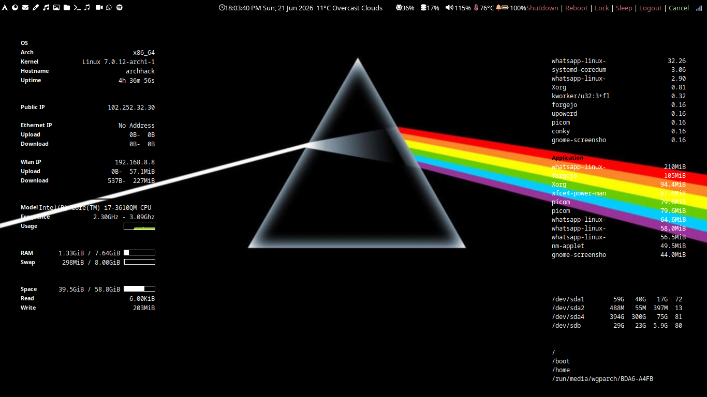

# bspwm Dotfiles

  

Binary Space Partitioning Tiling Window Manager with Dual Conky on Arch Linux.

---

## 📖 Documentation & Installation

For full installation instructions, keybinds, conky configuration, and theming details, please visit the **[Official Documentation Website](https://wgparch.github.io/bspwm/)**.

## 📸 Screenshots

